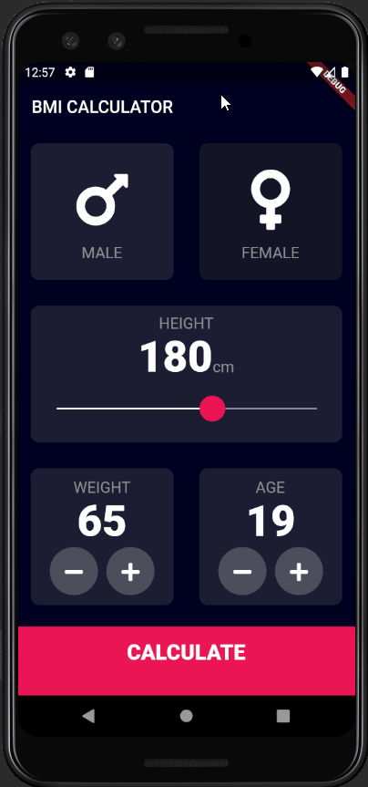

# bmi_calculator

This is a simple BMI calculator consisting of 2 screens, it was made in Flutter and it was made as project during a Flutter course which I took 
( https://www.appbrewery.co/p/flutter-development-bootcamp-with-dart )

